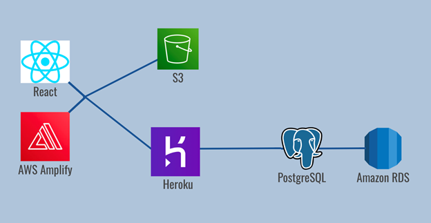

# LVConnect

## The Team

### Anthony Gatti, Aaron Chu-Carroll, Jack Keane, Matthew Bergin, Anh Vu

## Action Statement

### Uniting the Lehigh Valley

## Solution Overview

### See and Post Local Events

* Allows users to view local events and ways to get involved in their community
* Once logged in, users are able to post about events they know of or started

### Access Volunteer Opportunities

* Shows users various volunteer opportunities in the Lehigh Valley
* Promotes community service and involvement

### Chat in a Community Forum

* Allows users to chat with other members of the Lehigh Valley to promote connectedness and communication
* Users can ask questions, voice concerns, or just chat

### View Local Business Promotions

* Displays various promotions offered by local businesses to encourage Lehigh Valley residents to support them
* Allows business owners to promote their own deals and provides residents easy access to view them

## Architecture Diagram

## Potential Impact

* Promotes Social Engagement
* Supports Local Businesses
* Encourages Community Service
* Connects the Lehigh Valley